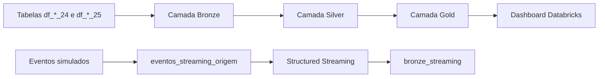

# 📊 Tech Challenge — Fase 2  
## Pipeline Híbrido para Análise da Alfabetização no Brasil


---

## 1. Contexto

A alfabetização na infância é um dos principais indicadores do desenvolvimento educacional de um país.

Neste projeto, foram utilizados dados relacionados à avaliação da alfabetização para construir uma pipeline de dados no Databricks, com processamento histórico em Batch, simulação de eventos em Streaming, tratamento dos dados em Arquitetura Medalhão e disponibilização de indicadores em um dashboard.

O ponto de corte utilizado para classificar um estudante como alfabetizado é de **743 pontos de proficiência**.

---

## 2. Objetivo

O objetivo do projeto é:

- processar dados educacionais de 2024 e 2025;
- organizar os dados nas camadas Bronze, Silver e Gold;
- limpar e padronizar os registros;
- integrar informações de alunos, municípios e estados;
- calcular indicadores de alfabetização;
- simular a chegada de novas medições por Streaming;
- disponibilizar os resultados em um dashboard no Databricks.

---

## 3. Estrutura do projeto

```text
tech_challenge/
├── bronze/
│   ├── bronze.py
│   └── bronze.sql
├── silver/
│   └── silver.py
├── gold/
│   └── gold.py
├── streaming/
│   └── streaming.py
├── dashboard/(na aba de dashboard do databricks)
└── README.md
```

---

## 4. Arquitetura

A solução utiliza a Arquitetura Medalhão.



### Fluxo Batch

```text
Tabelas de origem
        ↓
Bronze
        ↓
Silver
        ↓
Gold
        ↓
Dashboard
```

### Fluxo Streaming

```text
Eventos simulados
        ↓
eventos_streaming_origem
        ↓
Structured Streaming
        ↓
bronze_streaming
```

---

## 5. Camada Bronze

O arquivo `bronze.py` processa os anos de 2024 e 2025 para as seguintes entidades:

```text
aluno
municipio
estado
item
```

As tabelas de origem seguem o padrão:

```text
df_<entidade>_<ano>
```

Exemplos:

```text
df_aluno_24
df_aluno_25
df_municipio_24
df_municipio_25
```

Para cada entidade, o código cria uma tabela Bronze única:

```text
bronze_aluno
bronze_municipio
bronze_estado
bronze_item
```

Durante a ingestão, são adicionadas as colunas:

```text
dt_ingestao
origem
```

Os dados são gravados no formato Delta com `mergeSchema`.

Antes de uma nova execução, a tabela Bronze existente é removida e recriada. Dessa forma, os dados de 2024 e 2025 são consolidados novamente sem duplicar registros de execuções anteriores.

---

## 6. Camada Silver

O arquivo `silver.py` lê as tabelas Bronze e aplica os tratamentos utilizados no projeto.

Tratamentos realizados:

- nomes das colunas convertidos para letras minúsculas;
- remoção de registros duplicados;
- remoção de espaços extras em colunas de texto;
- contagem de valores nulos;
- filtro de alunos presentes na avaliação;
- remoção de alunos sem nota de Língua Portuguesa.

Regras específicas aplicadas aos alunos:

```text
in_presenca_lp = 1
vl_proficiencia_lp não pode ser nulo
```

Tabelas geradas:

```text
silver_aluno
silver_estado
silver_municipio
silver_item
```

As tabelas Silver são gravadas em Delta com sobrescrita controlada.

---

## 7. Camada Gold

O arquivo `gold.py` utiliza as tabelas Silver para integrar e agregar os dados.

A integração é feita pelas chaves:

```text
co_uf
co_municipio
```

Os dados de alunos são enriquecidos com:

```text
sg_uf
no_municipio
```

### Tabelas Gold geradas

```text
gold_aluno
gold_indicador_municipio
gold_indicador_estado
gold_indicador_brasil
```

### `gold_aluno`

A tabela `gold_aluno` mantém o nível individual e adiciona a coluna:

```text
status_alfabetizacao
```

Valores possíveis:

```text
Alfabetizado
Não Alfabetizado
```

### Indicadores calculados

```text
total_alunos
media_proficiencia_lp
percentual_alfabetizados
```

O percentual de alfabetizados é calculado pela média do campo `in_alfabetizado`, multiplicada por 100.

### Granularidades disponíveis

- aluno;
- município;
- estado;
- Brasil;
- dependência administrativa;
- ano de avaliação.

---

## 8. Processamento Batch

O processamento Batch é utilizado para consolidar os dados históricos de 2024 e 2025.

Entidades processadas:

```text
aluno
municipio
estado
item
```

O Batch é executado pelo arquivo:

```text
bronze/bronze.py
```

---

## 9. Processamento Streaming

O arquivo `streaming.py` implementa uma simulação de ingestão em Streaming com PySpark Structured Streaming.

O processo:

- seleciona um município existente na camada Gold;
- cria 30 eventos simulados;
- gera um `id_evento` único;
- registra a data do evento;
- simula valores de proficiência;
- classifica o estudante como alfabetizado quando a proficiência é maior ou igual a 743;
- grava os eventos em uma tabela Delta de origem;
- lê os eventos com `readStream`;
- grava os registros com `writeStream`;
- utiliza `append`;
- utiliza checkpoint em um Volume;
- executa com `AvailableNow`.

Tabelas e recursos utilizados:

```text
eventos_streaming_origem
bronze_streaming
checkpoints_streaming
```

O Streaming implementado é uma simulação incremental e termina após processar os eventos disponíveis.

---

## 10. Qualidade dos dados

As regras de qualidade aplicadas no projeto são:

| Regra | Implementação |
|---|---|
| Remoção de duplicados | `dropDuplicates()` |
| Filtro de presença | `in_presenca_lp = 1` |
| Remoção de notas ausentes | `vl_proficiencia_lp.isNotNull()` |
| Padronização de colunas | conversão para minúsculas |
| Padronização de texto | `trim()` |
| Análise de nulos | contagem de nulos por coluna |
| Integração territorial | joins por `co_uf` e `co_municipio` |
| Rastreabilidade Batch | `dt_ingestao` e `origem` |
| Rastreabilidade Streaming | `id_evento`, `dt_evento`, `dt_ingestao` e `origem` |

---

## 11. Monitoramento

O monitoramento implementado ocorre por meio das mensagens e resultados exibidos durante a execução dos arquivos.

São apresentados:

- quantidade de registros na Bronze;
- quantidade após remoção de duplicados;
- quantidade após filtro de presença;
- quantidade após remoção de notas nulas;
- contagem de valores nulos;
- total de registros de alunos;
- total após integração com municípios e estados;
- confirmação da criação das tabelas;
- início e término do Streaming;
- total de eventos armazenados.

---

## 12. Dashboard

O dashboard foi desenvolvido diretamente no Databricks.

Ele utiliza as tabelas da camada Gold para apresentar:

- total de alunos avaliados;
- percentual de alfabetizados;
- média de proficiência;
- quantidade de municípios avaliados;
- percentual de alfabetizados por estado;
- proficiência média por estado;
- dez municípios com maior percentual de alfabetização;
- dez municípios com menor percentual de alfabetização;
- alfabetização por dependência administrativa;
- dados detalhados por município.

O dashboard permite visualizar os indicadores de forma executiva e comparar os resultados territoriais.

O dashboard é encontrado dentro da aba de dashboard do databricks

---

## 13. Tecnologias utilizadas

| Tecnologia | Uso no projeto |
|---|---|
| Databricks | desenvolvimento, execução e dashboard |
| Apache Spark | processamento dos dados |
| PySpark | implementação da pipeline |
| Delta Lake | armazenamento das tabelas |
| Structured Streaming | simulação de eventos incrementais |
| Unity Catalog | catálogo e Volume de checkpoint |
| Databricks AI/BI | construção do dashboard |

---

## 14. Decisões arquiteturais

### Batch e Streaming

O Batch foi utilizado para os dados históricos de 2024 e 2025.

O Streaming foi utilizado para simular novas medições de desempenho.

### Lakehouse

As tabelas Bronze, Silver e Gold são armazenadas no mesmo ambiente Databricks em formato Delta.

### Dashboard no Databricks

O dashboard foi criado no próprio Databricks, sem necessidade de integração com uma ferramenta externa de BI.

---

## 15. FinOps

As decisões utilizadas para reduzir processamento desnecessário foram:

- uso de tabelas Delta;
- criação de tabelas Gold agregadas;
- seleção das colunas necessárias na Gold;
- remoção de duplicados antes das agregações;
- uso de Serverless;
- uso de `AvailableNow` no Streaming;
- uso de checkpoint;
- execução do dashboard no mesmo ambiente dos dados.

O projeto não possui uma estimativa monetária automatizada de custos.

---

## 16. Aplicações futuras em inteligência artificial

As tabelas Gold podem ser utilizadas futuramente para:

- modelos de predição de alfabetização;
- análise de desigualdade entre estados e municípios;
- agrupamento de municípios com resultados semelhantes;
- identificação de regiões com baixo desempenho;
- apoio à tomada de decisão em políticas públicas.

Essas aplicações não fazem parte da implementação atual.

---

## 17. Como executar

Execute os arquivos na seguinte ordem:

```text
1. bronze/bronze.py
2. silver/silver.py
3. gold/gold.py
4. streaming/streaming.py
5. atualizar o dashboard
```

---

## 18. Tabelas geradas

### Bronze

```text
bronze_aluno
bronze_municipio
bronze_estado
bronze_item
bronze_streaming
eventos_streaming_origem
```

### Silver

```text
silver_aluno
silver_municipio
silver_estado
silver_item
```

### Gold

```text
gold_aluno
gold_indicador_municipio
gold_indicador_estado
gold_indicador_brasil
```

---

## 19. Escopo atual

O projeto atualmente possui:

- ingestão Batch;
- processamento dos anos de 2024 e 2025;
- camadas Bronze, Silver e Gold;
- tabelas Delta;
- tratamento de duplicados;
- tratamento de valores nulos;
- filtro de presença;
- integração de alunos, municípios e estados;
- indicadores por aluno, município, estado e Brasil;
- simulação de Streaming;
- dashboard no Databricks.

O projeto atualmente não possui:

- tabelas de metas nacionais, estaduais ou municipais;
- comparação entre meta e resultado;
- fontes socioeconômicas externas;
- processamento dos eventos de Streaming nas camadas Silver e Gold;
- alertas automáticos;
- estimativa monetária automatizada de custos;
- modelos de Machine Learning implementados.

---

## 20. Conclusão

O projeto implementa uma pipeline híbrida para análise da alfabetização no Brasil.

A camada Bronze consolida os dados históricos, a Silver realiza limpeza e padronização e a Gold cria dados analíticos por aluno, município, estado e Brasil.

O Streaming simula novas medições de desempenho e o dashboard apresenta os principais indicadores educacionais de forma visual.

A solução utiliza Databricks, PySpark, Delta Lake e Structured Streaming para organizar e analisar os dados disponíveis no projeto.
